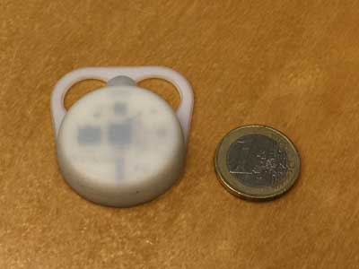
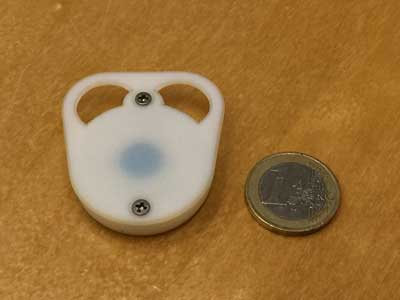

# openbeacon-case
##OpenBeacon proximity tag case##

Taking part in a study involving 70 participants, and having no available case fitting our needs for the proximity tag we'd use, we decided to design our own.

Technical details about the tag can be found on [OpenBeacon.org](http://get.openbeacon.org/device.html#download).

Our main challenges were:

- **Maximize the compliance of hospital personals and patients taking part in our planned study.** To help achieve the best possible compliance, the case should have a dedicated space to hold a sticker with the hospital logo, and should be nice-looking of course.
- **Have a tag that could be hooked to a lanyard.**
- **The case should be relatively easy to open and close, but not too much so.** Easy for battery replacement or whenever direct access to the PCB is needed, but not so easy that no tool is needed.
- **Take advantage of the full capabilities of the tag.** One of the requirements was that the tag point towards the front and stay so.
- **Find the right 3D design tool.** We are no 3D designers, we work on Macs and we wanted fast results, so after reviewing a few softwares, we chose [123d Design](http://www.123dapp.com/design) by AUTODESK. Its learning curve seemed the best of all reviewed tools, the examples looked great, it can export .STL files used by 3D printers and it's free.

We didn't need a case:

- that could resist huge shocks
- that could be used outdoors
- that could be used for years

**3D-Printing**

The case was printed at the [Centre universitaire d'informatique](http://www.cui.unige.ch/en/), Geneva University by a Stratasys [Objet260](http://www.stratasys.com/3d-printers/design-series/objet260-connex1). Thanks to Daniel Agulleiro for his great advices and help.

**Signal attenuation**

A rapid set of test measurements done at the [ISI Foundation](http://www.isi.it) in Torino, with and without the case, seemed to show that, despite being measurable, the signal attenutation by the case would not affect the quality of the interaction measurements.

